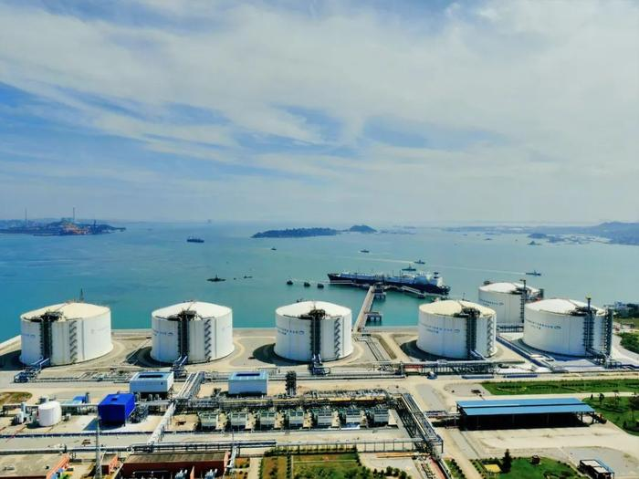
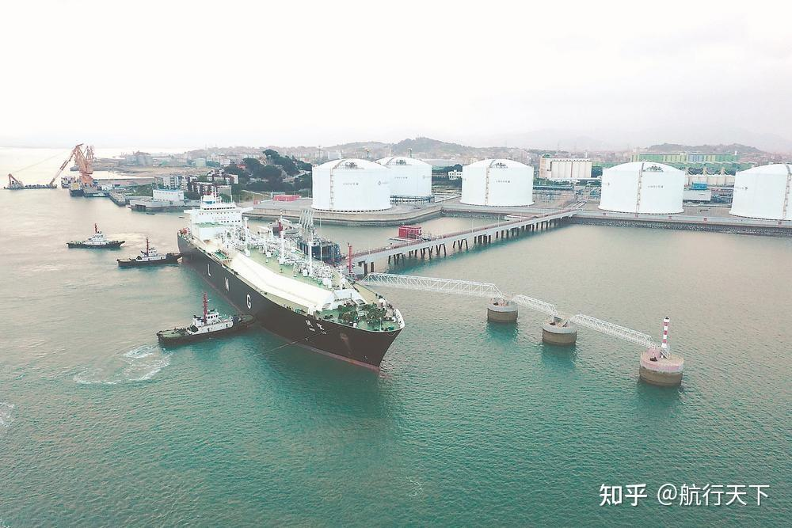

# 福建莆田LNG接收站 - 中海油

## 主要指标
|指标|数值|
|---|--------|
|**公司名称**|中海福建天然气有限责任公司|
|**电话**|0591-86312138|
|**注册资本**|221,354.8453万(元)|
|**公司地址**|福建省莆田市秀屿区东庄镇前云村望山东路999号|
|**项目位置**|福建省莆田市秀屿区|
|**主要设施**|16万×6|
|**保税**|无|
|**接收能力**|630万吨/年|
|**气化外输**|福建省政府按一体化门站价方式定价|
|**液态外输**|福建省政府按一体化门站价方式定价|
|**投资方**|海油气电60%、福建省投资开发集团40%|
|**投产时间**|2008年|
|**2024年接卸**|373|

## 简介

福建莆田LNG接收站 是中国内地第一个完全由国内企业自主引进、建设、管理的大型液化天然气项目，包括接收站、码头和输气干线三个单项工程。一期工程资源供应方为印尼东固项目，建设规模为年接收260万吨LNG。项目于2005年4月开工，2008年4月顺利接收第一船LNG用于调试，并将于2009年上半年投入商业运营。

LNG专用码头项目：包括一座可停泊8～16.5万立方米LNG船的泊位和工作船码头、345.5米长的栈桥等。根据国际船运事业的发展状况，LNG码头将在2009年扩能至可停泊21.5万立方米的LNG船。

## 图片

