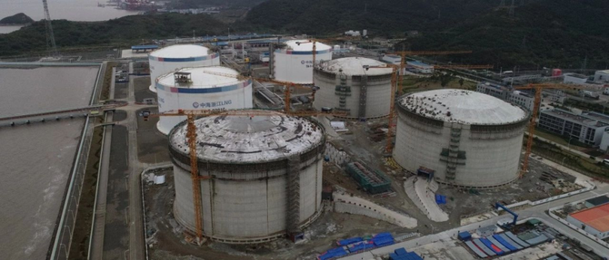

# 宁波LNG接收站 - 中海油

## 主要指标
|指标|数值|
|---|--------|
|**公司名称**|中海浙江宁波液化天然气有限公司|
|**电话**|86010888|
|**注册资本**|188,276万(元)|
|**公司地址**|浙江省宁波市北仑区郭巨街道白中线峙北段388号|
|**项目位置**|浙江省宁波北仑区穿山半岛公鹅咀地块|
|**主要设施**|16万×6|
|**保税**|32万|
|**接收能力**|600万吨/年|
|**气化外输**|0.1800元/方|
|**液态外输**|未知|
|**投资方**|海油气电 51%、浙能天然气29%、宁波开发投资集团20%|
|**投产时间**|2012年|
|**2024年接卸**|430|

## 简介

浙江宁波LNG项目一期工程建设三座16万方全容式LNG储罐、一座LNG专用码头（可接卸最大船容为26.6万方）及相关配套设施。2009年6月28日，宁波LNG项目一期项目工程获得国家发改委核准与批复。同年12月18日，一期项目正式开建。2012年9月19日，浙江宁波LNG接收站完成第一船LNG的接卸，并开始正式试运行。一期总罐容48万立方米，项目周转能力为300万吨/年。

浙江宁波LNG接收站于2018年6月27日正式开建二期工程，新增3座16万方LNG储罐和相应配套设施，2020年底机械完工。

截至2025年6月，拥有29台槽车装车橇、6座储罐（总容量96万立方米）及配套外输设施，管网剩余输送能力通过国家管网设施公平开放平台按月公示。2022年数据显示，单船7万吨LNG可满足浙江省2500万户居民4天用气需求。

三期规划：建设6座27万方储罐，设计年接收能力600万吨，建成后总产能达1200万吨

## 图片

