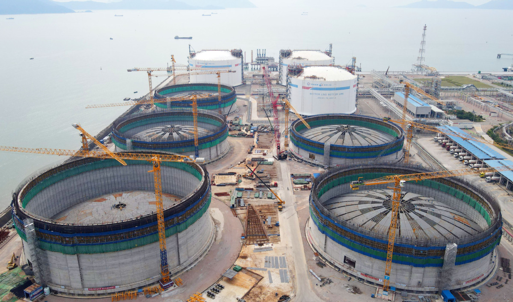

# 珠海LNG - 中海油

## 主要指标
|指标|数值|
|---|--------|
|**公司名称**|中海油珠海天然气发电有限公司|
|**电话**|0756-7862163|
|**注册资本**|72,970.5万(元)|
|**公司地址**|广东省珠海市高栏港经济区洁能路771号|
|**项目位置**|广东省珠海市高栏港经济区洁能路771号 |
|**主要设施**|16万×3 27万x5（2025年陆续投产）|
|**保税**|16万|
|**接收能力**|700万吨/年|
|**气化外输**|未知|
|**液态外输**|未知|
|**投资方**|海油气电30%、广东省能源集团25%、广东发展燃气投资有限公司25%、广东粤港能源发展有限公司8%、江门市城建集团有限公司3%、珠海经济特区电力开发集团有限公司3%、中山兴中能源发展股份有限公司3%、佛山市华拓能能源投资有限公司3%|
|**投产时间**|2013年|
|**2024年接卸**|420|

## 简介
珠海LNG位于金湾区高栏港，是珠江口西岸最大的液化天然气接收站，一期项目于2013年投产，液化天然气年处理能力为350万吨，是中国首个完全自主试车的液化天然气项目，投产至今累计进口液化天然气超2000万吨，成为保障粤港澳大湾区和华南地区能源安全的“主力军”之一。

为充分利用宝贵的岸线和土地资源，中国海油积极推进珠海LNG扩容建设，提高粤港澳大湾区天然气供应的稳定性、可靠性和安全性。珠海LNG二期项目于2021年6月开工建设，同时建设5座27万立方米液化天然气储罐及配套设施，2024年建成投产后，珠海LNG将成为华南地区规模最大的天然气储运基地，年处理能力可达700万吨，折合气态天然气约100亿立方米。按照1户居民每月用气30立方米计算，100亿立方米天然气大约可供近3000万户居民使用1年。

据介绍，珠海LNG二期项目现场靠山面海，区域内地震力大、地震设防等级高，存在海沟、漏斗等复杂地形，给27万立方米液化天然气储罐设计建造工作带来巨大挑战。为此，为确保单罐重达200多吨的超大型液化天然气储罐立得住、站得稳，中国海油储罐技术团队自主开发了变刚度协调设计群桩基础技术，平衡荷载分配，降低不均匀沉降风险，优化后桩基荷载的平均差值减小83%，发生局部破坏和失稳情况的概率大大下降。

珠海LNG二期项目是在一期项目基础上就地扩建，项目占地面积受限，设计团队针对性地开发了有效容积比更优、土地利用率更高、储罐设计难度更大的高瘦型设计方案，实现了超高剪力墙减隔震设计、超长环形预应力混凝土结构设计等技术突破，使我国在超大型液化天然气储罐设计建造技术方面达到国际领先水平。

据珠海LNG二期项目经理韩小康介绍，粤港澳大湾区首座27万立方米储罐直径达94.2米，高65.7米，单罐混凝土浇筑量45000立方，工程量巨大。项目建设团队创新应用智慧工地、内罐全自动TT焊接等多项自主技术，依托数智管理平台对关键作业流程进行在线分析优化，大幅提升施工安全、质量和效率，实现310万工时零事故，创造了7天完成单层施工的行业最快纪录，以100%合格率通过拱顶块密封性测试，为项目成功升顶提供坚实保障。

## 参考文献
[1.珠海LNG二期新进展！粤港澳大湾区首座超大液化天然气储罐主体完工
](https://pub-zhtb.hizh.cn/s/202302/07/AP63e24e49e4b0234aa099108d.html)