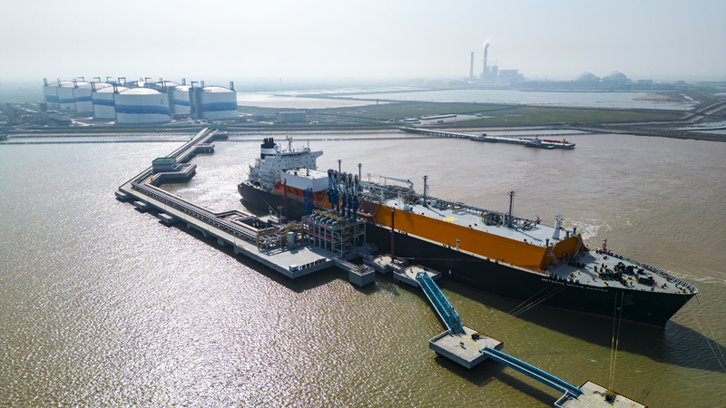
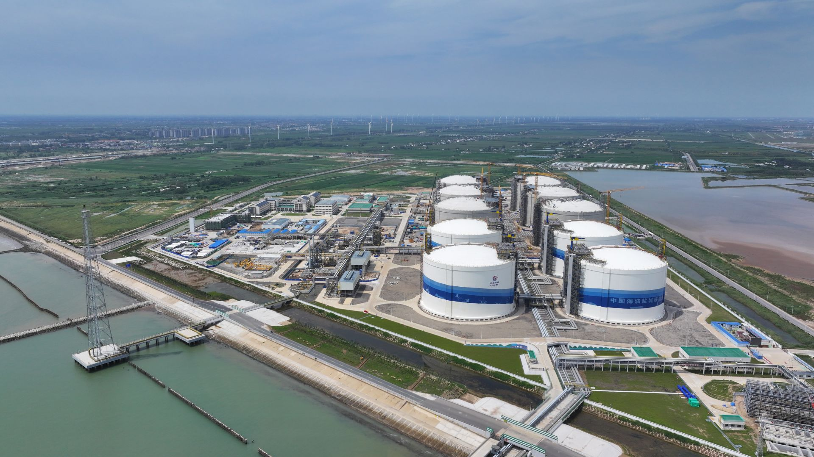

# 江苏盐城滨海LNG接收站 - 中海油

## 主要指标
|指标|数值|
|---|--------|
|**公司名称**|中海油江苏天然气有限责任公司|
|**电话**|0515-80850688|
|**注册资本**|266,765.59万(元)|
|**公司地址**|盐城市滨海港工业园区海油路南侧|
|**项目位置**|盐城市滨海港工业园区海油路南侧|
|**主要设施**|22万×4 27万x6（2024年陆续投产）|
|**保税**|无|
|**接收能力**|600万吨/年|
|**气化外输**|0.26元/方|
|**液态外输**|0.26元/方|
|**投资方**|海油气电76%、淮河能源燃气集团24%|
|**投产时间**|2022年|
|**2024年接卸**|305|

## 简介

中海油滨海LNG接收站是中国海洋石油集团有限公司（简称“中海油”）在华东地区布局的重要液化天然气（LNG）枢纽项目。该项目分两期建设：

一期工程：2019年5月开工，2022年6月投产，设计年接收能力300万吨，建设内容包括4座16万立方米储罐（后调整为22万立方米）及配套码头设施。

一期扩建工程：2021年6月启动，新增6座27万立方米储罐及气化设施，2023年底完成机械完工，扩建后总接收能力提升至600万吨/年，其中气态外输420万吨/年，液态槽车外输180万吨/年。
项目总投资约140亿元，是长三角地区天然气产供储销体系的核心组成部分，旨在缓解江苏、安徽及周边省份的天然气供需矛盾。

接收站位于江苏省盐城市滨海县滨海港，地处长三角北翼，毗邻黄海，是华东地区LNG进口的重要门户。其地理位置具有以下特点：依托滨海港深水航道，可停泊8万至26.6万立方米LNG运输船（主力船型为17.7万立方米）；通过苏皖输气管网辐射江苏、安徽、河南等省份，并与长三角天然气主干网互联互通。

占地面积：接收站陆域占地55.86万平方米，海域使用面积206万平方米，配套建设LNG专用码头、工作船码头及火炬平台。

气源多元化：初期气源来自澳大利亚和卡塔尔长期协议，未来计划拓展至俄罗斯、东南亚等地区。
储运协同：与配套的苏皖输气管线、阜宁燃气电厂形成“接收站-管网-终端”一体化供应体系，提升资源调配效率。

一期储罐总容量88万立方米（4×22万立方米），扩建后增至214万立方米（新增6×27万立方米）；码头配备高效卸料系统，单船接卸周期压缩至20小时以内，年周转能力达600万吨。
环境效益：项目全部投产后，年减排二氧化碳约840万吨，助力江苏省实现“双碳”目标。
应急保障：在冬季用气高峰期间，通过液态槽车外输补充区域调峰需求，增强供应韧性。

中海油滨海LNG接收站通过规模化储运设施、多元股东合作及国际资源整合，成为华东地区能源转型的核心支点。未来，随着二期工程规划推进（如延伸至苏皖南部及河南），其战略地位将进一步提升，为我国天然气保供与低碳发展提供关键支撑。

## 参考文献
[1.江苏滨海港：千亿产业聚势蓄能 滨海驶向“蓝海”](https://www.xhby.net/content/s66532e7ae4b00f32bf716047.html)

