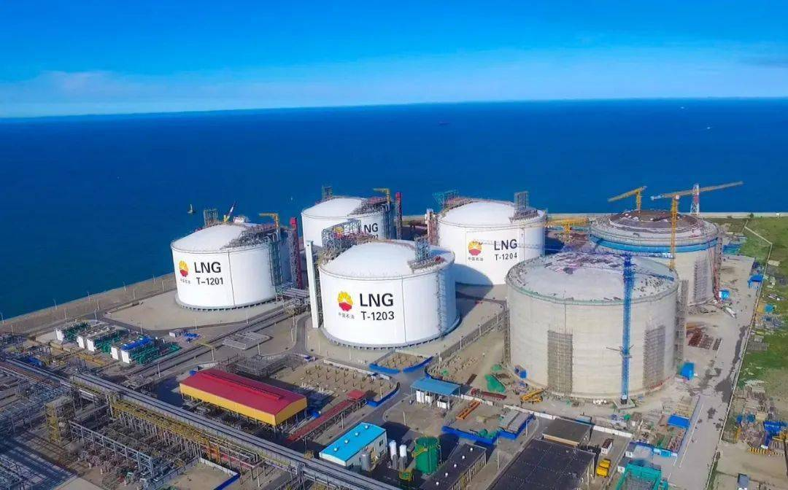

# 江苏南通如东LNG接收站 - 中石油

## 主要指标
|指标|数值|
|---|--------|
|**公司名称**|中石油江苏液化天然气有限公司|
|**电话**|0513-88153366|
|**注册资本**|316,591.8万(元)|
|**公司地址**|江苏省南通市|
|**项目位置**|江苏省如东县洋口港经济开发区阳光岛|
|**主要设施**|16万×3、20万×3|
|**保税**|无|
|**接收能力**|1000万吨/年|
|**气化外输**|0.3467元/方|
|**液态外输**|0.3126元/方|
|**投资方**|昆仑能源有限公司55%、太平洋能源35%、江苏国信10%|
|**投产时间**|2011年|
|**2024年接卸**|650|

## 简介

中石油江苏LNG接收站是国家重点工程，现拥有6座LNG储罐，总罐容108万立方米。自投产以来，接卸了来自俄罗斯、秘鲁、卡塔尔等26个国家的LNG，其中70%为“一带一路”共建国家。仅2024年，中石油江苏LNG接收站就外输天然气92亿立方米，为经济发展活跃的长三角地区稳定可靠供气。

2025年1月10日，在江苏如东洋口港中石油江苏LNG接收站，从卡塔尔运来26万立方米LNG的运输船顺利靠泊，这是今年洋口港到港的第三艘进口LNG船舶。这些LNG经过接收站气化后，可为刚刚迎来寒潮的长三角地区输出1.6亿立方米天然气。据了解，目前中石油江苏LNG接收站每天外输天然气3900万立方米，以冲峰能力全力送暖。

2025年6月中石油江苏LNG扩建储罐项目开工（四期）,将重点建设1座20万立方米的LNG储罐相关配套设施、新建管道等工程每天新增气化外输能力1750万方预计2029年项目建成投产。

接收站接卸、存储气化、外输能力将全面达到每年1000万吨单日气化外输能力提升至5650万方为长三角地区天然气安全稳定供应再添“压舱石”

## 参考文献
[1.江苏如东：LNG接收站满负荷保供天然气](http://csj.xinhuanet.com/20250113/6a71cbb0475d4019bac5a5716b44c448/c.html)

