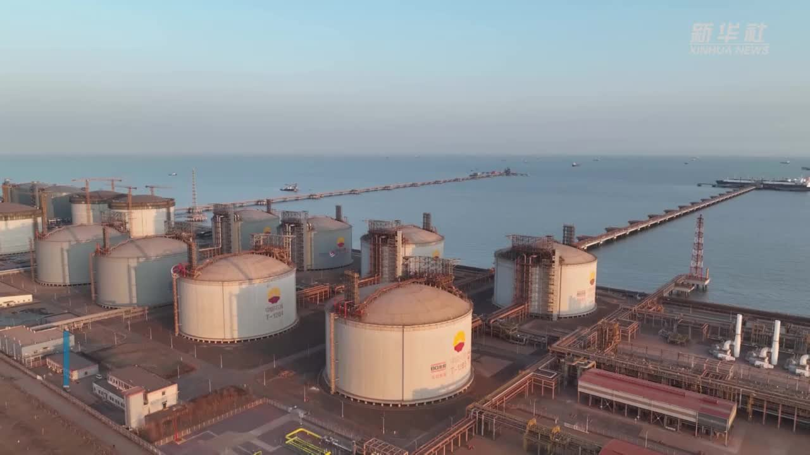

# 河北唐山曹妃甸LNG接收站 - 中石油

## 主要指标
|指标|数值|
|---|--------|
|**公司名称**|中石油京唐液化天然气有限公司|
|**电话**|010-87156386|
|**注册资本**|316,591.8万(元)|
|**公司地址**|河北唐山曹妃甸工业区甸头区|
|**项目位置**|河北唐山曹妃甸工业区甸头区|
|**主要设施**|16万×8|
|**保税**|无|
|**接收能力**|1000万吨/年|
|**气化外输**|0.3303元/方|
|**液态外输**|0.3144元/方|
|**投资方**|中石油昆仑燃气51%、北京北燃京唐29%、河北天然气20%|
|**投产时间**|2013年|
|**2024年接卸**|482|

## 简介

本项目包括接收站工程、码头工程和站外系统配套工程，冷能利用系统。
接收站工程设计规模：一期650×104t/a；二期350×104t/a；远期1000万t/a。

码头工程设计规模：可停靠12.5～27万m3的LNG运输船泊位1座，远期预留相同规模的泊位1座。
本项目分期建设，一期工程计划于2013年8月机械竣工，2013年10月正式投产运营。

接收站场地属于滨海浅滩，表层为新近吹填的海砂层，已做强夯处理。场地为近似矩形的四边形，面积约45.92公顷。接收站工程主要由储罐系统、工艺装置系统、辅助生产系统、公用工程系统以及站外配套系统组成，其功能是接卸由LNG远洋输送船运来的LNG，在LNG储罐内储存，在ORV,SCV中进行气化，气化后的燃气送至燃气输气干线。

项目建成后将为华北地区增加一个新的可靠供气气源，用以补充京津冀地区的天然气需求，并可满足北京、天津、唐山、秦皇岛等地区季节性天然气调峰需求，对保证天然气用户安全平稳用气具有重要的保障作用，是国家能源战略的重要组成部分。

作为国家天然气产供储运体系重点工程，唐山LNG项目规划建设20座20万立方米储罐，设计接卸能力1200万吨/年，设计气化外输量达1.4亿立方米/天，是环渤海地区设计储存能力、外输能力最大的LNG接收站项目。

## 参考文献
[1.中国石油唐山LNG接收站累计外输天然气超500亿立方米](http://zygh.tangshan.gov.cn/ts/xwdt/10899642327357734912.html)
[2.唐山LNG项目](https://baike.baidu.com/item/%E5%94%90%E5%B1%B1LNG%E9%A1%B9%E7%9B%AE/8393926)