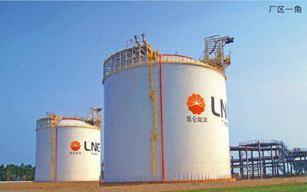
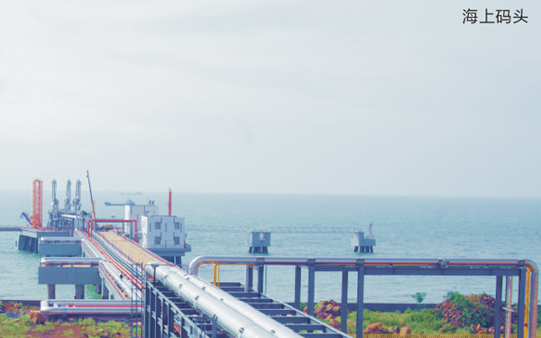

# 海南深南LNG接收站 - 中石油

## 主要指标
|指标|数值|
|---|--------|
|**公司名称**|海南中油深南能源有限公司|
|**电话**|0898-31635106|
|**注册资本**|5000万(元)|
|**公司地址**|海南省澄迈县老城工业区|
|**项目位置**|海南省澄迈县老城镇高新技术产业示范区海南生态软件园孵化楼4001|
|**主要设施**|2万×2|
|**保税**|无|
|**接收能力**|60万吨/年|
|**气化外输**|未知|
|**液态外输**|未知|
|**投资方**|海南中油深南石油技术开发有限公司90%（昆仑能源有限公司全资子公司）、海南富山油气化工10%|
|**投产时间**|2014年|
|**2024年接卸**|11万吨|

## 简介

2012年6月，为改变海南天然气供应不足状况，增加天然气供应和应急保障能力，海南省发改委批准同意建设海南中油深南LNG储备库及配套码头工程项目。海南中油深南LNG储备库及配套码头工程项目位于澄迈县老城开发区，项目用地面积约430亩，主要建设20万立方米的LNG罐和配套设施(一期建设2x2万立方米LNG罐，二期和三期各建设8万立方米LNG罐)及建设可靠泊1万至2万立方米LNG码头一座。

## 参考文献
[1.海南中油深南能源有限公司](http://www.hnfsjt.com.cn/news_show.php?id=639)
