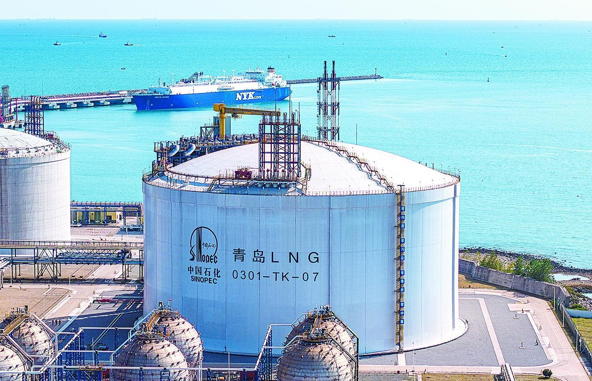

# 青岛LNG - 中石化

## 主要指标
|指标|数值|
|---|--------|
|**公司名称**|中国石化青岛液化天然气有限责任公司|
|**电话**|0531-58658650|
|**注册资本**|375,000万(元)|
|**公司地址**|山东省青岛市黄岛区双珠路197号卓越金融广场1号楼21-23层|
|**项目位置**|山东省青岛市黄岛区|
|**主要设施**|16万×6 27万x1|
|**保税**|无|
|**接收能力**|1100万吨/年|
|**气化外输**|0.19|
|**液态外输**|0.19|
|**投资方**|中国石油化工股份有限公司79.2%、青岛能源集团有限公司20%、青岛港国际股份有限公司0.8%|
|**投产时间**|2014年|
|**2024年接卸**|548万吨|

## 简介

中国石化首个液化天然气项目, 2014年11月14日，首船“科罗尼斯”号LNG运输船顺利抵达本站正式投入运营。

2022年1月10日，昆仑实华BOG（蒸发气）和青宁管线两条外输通道一次性投产成功，实现了三期接收站工程全面投运，形成了2路BOG和3路干线的多支路外输一体化新格局；2023年11月2日，建成并投用了世界最大、国内首台27万立方米的超大型液化天然气储罐；2024年6月2日，利用“双泊位”码头优势成功完成了国内首次LNG船舶气试、接卸同步作业，开创了LNG储运设施经营的新模式。2023年，青岛LNG接收站接卸总量在国内LNG接收站中排名第3.

### 大事记

#### 2014年11月14日

青岛LNG接收站完成来自巴布亚新几内亚的第一船LNG资源接卸，标志着中国石化第一座LNG接收站正式投产

#### 2015年4月15日

建成亚洲首套LNG接收站轻烃回收装置

#### 2018年3月2日

自投产以来累计接卸量突破1000万吨

#### 2021年1月15日

智能运营管理新平台正式投用

#### 2022年9月7日

首次引入智能巡检机器人

#### 2023年11月2日

正式投用我国首座27万立方米液化天然气储罐，这也是目前全球容量最大的天然气储罐

#### 2023年12月29日

投运国内首台LNG全自动装车撬

#### 2024年1月13日

正式投用山东省内首座“双泊位”LNG码头

#### 2024年6月2日

利用“双泊位”码头优势成功完成了国内首次LNG船舶气试、接卸同步作业，开创了LNG储运设施经营新模式

## 参考文献
[1.天然气分公司青岛LNG接收站 十年砥砺奋进 首站再启新程](http://www.sinopecnews.com.cn/xnews/content/2024-11/14/content_7110811.html)
