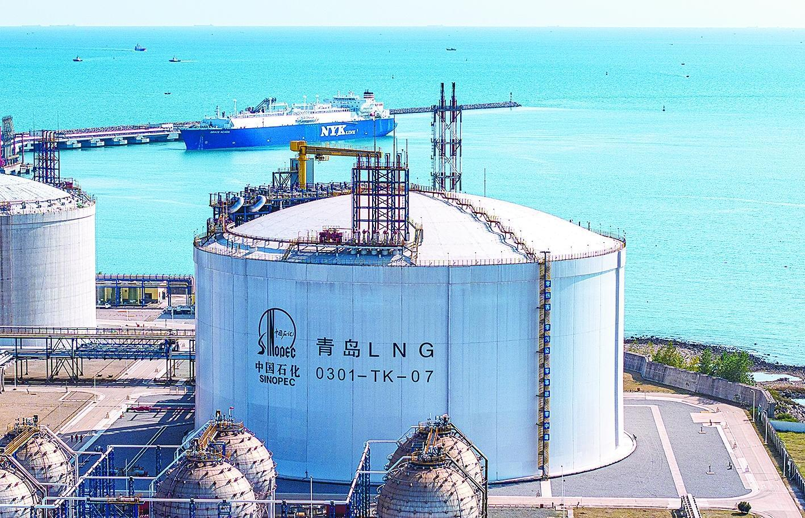

# 申能洋山LNG接收站 - 申能集团

## 主要指标
|指标|数值|
|---|--------|
|**公司名称**|申能洋山液化天然气有限公司|
|**电话**|021-23195555|
|**投资方**|申能集团有限公司|
|**注册资本**|540,000万(元)|
|**公司地址**|浙江省舟山市嵊泗县洋山镇小洋山嵊兴二路1号洋山综合管理服务大楼六楼608室|
|**项目位置**|上海洋山深水港|
|**主要设施**|2座16万立方米储罐、1座LNG专用|
|**保税**|无|
|**接收能力**|万吨/年|
|**气化外输**|未知|
|**液态外输**|示知|
|**投产时间**|年|
|**2024年接卸**|万吨|

## 简介

 中石化天津LNG接收站年接卸能力达1080万吨。2023年11月，该站二期工程投产。二期工程采用国产化技术建成5座22万立方米储罐，总储气容量提升至10.8亿立方米，调峰能力较一期增强45%，可满足7200万户家庭冬季一个月的用气需求。

## 参考文献
[1.中石化天津LNG接收站累计接卸量突破4000万吨](https://www.msn.cn/zh-cn/news/other/%E4%B8%AD%E7%9F%B3%E5%8C%96%E5%A4%A9%E6%B4%A5lng%E6%8E%A5%E6%94%B6%E7%AB%99%E7%B4%AF%E8%AE%A1%E6%8E%A5%E5%8D%B8%E9%87%8F%E7%AA%81%E7%A0%B44000%E4%B8%87%E5%90%A8/ar-AA1DAONn?ocid=BingNewsLanding&cvid=c563e44d209e4c53abc36c5bbdea0926&ei=8)
