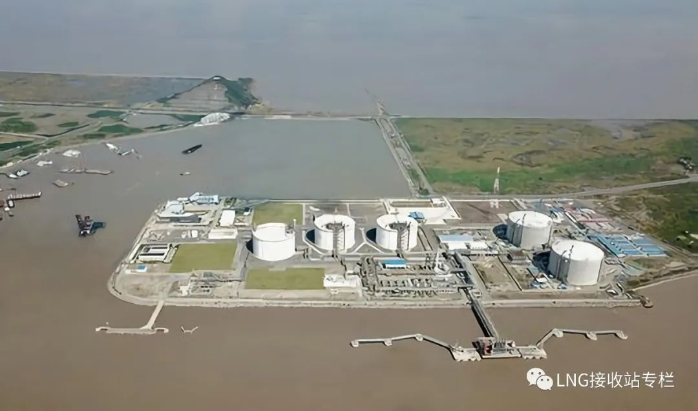

# 申能洋山LNG接收站 - 申能集团

## 主要指标
|指标|数值|
|---|--------|
|**公司名称**|申能洋山液化天然气有限公司|
|**电话**|021-23195555|
|**投资方**|申能 60%、海油气电20%、浙能集团20%|
|**注册资本**|540,000万(元)|
|**公司地址**|上海洋山深水港|
|**项目位置**|上海洋山深水港|
|**主要设施**|3x16万 2x20万|
|**保税**|20万|
|**接收能力**|300万吨/年|
|**气化外输**|0.2147|
|**液态外输**|-|
|**投产时间**|2009|
|**2024年接卸**|390万吨|

## 简介

上海市最大的LNG接收站——洋山LNG接收站。它是上海天然气供应、调峰和应急的主力成员。其供气量占全市用气量的50%以上，高峰期间占比达65%，是上海市的主力气源和天然气供应的“生命线”。

上海洋山LNG接收站一期包括接收站陆域、码头和海底输气干线，运营规模为300万吨每年，每年可向上海市区供应约40亿立方米天然气。

接收站于2009年11月开始为上海市提供天然气，目前已成为上海市天然气稳定供应和调峰应急的主力气源。

作为一流水平的清洁能源供应基地，与西气一线、西气二线、川气、江苏如东、东海天然气和五号沟LNG一同构成多气源供应格局，共同保障上海的能源安全。

上海洋山LNG接收站位于洋山深水港区中西门堂岛，隶属于上海液化天然气有限责任公司。其中，申能(集团)有限公司持股55%，中海石油气电集团有限责任公司持股45%。

该站包括3座16万立方米LNG储罐（总罐容48万立方米）、3台LNG卸料臂及其他相应的回收、输送、气化设施和公用配套工程，占地39.6公顷。

其中，6套LNG气化装置为：SCV*2 + IFV*4。

洋山LNG接收站还包括一个10万吨级LNG专用码头、36公里海底天然气管线和16公里陆域输气管线。

通过LNG船运来的LNG，在气化后进行外输，通过东海大桥预设的海底天然气管线输送到临港新城输气站，随后进入上海城市天然气高压主干官网系统。

早在2009年11月，上海洋山LNG接收站就已经投用，被称为“一期工程”。洋山LNG一期目前的年供应量占到上海天然气需求量的50%以上。

一期项目LNG储罐扩建工程（新增两座20万方LNG储罐及配套设施），扩建工程已经投产，总储存能力增加到88万m³，储气能力提升近80%。

洋山LNG接收站气化外输能力将由目前的104万方每小时提升到214万方每小时，将为上海天然气安全、稳定供应提供更强有力的支撑和保障。

## 主要里程碑

▲ 2004年12月31日，中海石油气电集团与上海申能集团在上海举行合资合同签字仪式，成立上海液化天然气有限责任公司，其中申能集团持股55％，中海石油气电集团持股45％。

▲ 2005年5月18日，上海洋山LNG接收站项目开始场平施工。

▲ 2009年11月17日，上海洋山LNG接收站一期工程项目建成投产，设计规模300万吨每年。

▲ 2016年5月，上海洋山LNG接收站扩建工程项目获得核准。

▲ 2016年11月，上海洋山LNG接收站扩建工程项目正式开工，扩建工程拟新增2座20万立方米LNG储罐；新增1台BOG压缩机、4台高压输出泵、3台IFV和1台SCV等主要工艺设备以及配套的海水系统。

▲ 2017年12月8日，中核五公司与上海液化天然气有限责任公司签订扩建项目储罐和槽车区工程施工总承包合同。

▲ 2017年12月26日，扩建工程储罐和槽车区工程获得施工许可证。

▲ 2018年9月12日，扩建工程4号储罐外墙第一层顺利浇筑。

▲ 2019年3月22日，上海洋山LNG接收站储罐扩建工程4号储罐气升顶圆满成功。

▲ 2019年4月25日，上海洋山LNG接收站储罐扩建工程5号储罐气升顶圆满成功。

▲ 2019年11月19日，上海洋山LNG接收站新增气化设施宣告投运成功。接收站最大小时气化外输能力将由104万立方米增至214万立方米，为上海今冬用气再添保障。

▲ 2019年12月24日，扩建工程4号储罐开始进行水压试验。

▲ 2020年7月，上海洋山LNG接收站储罐扩建工程计划试运行。

## 参考文献
[1.细说上海洋山LNG接收站](https://finance.sina.com.cn/money/future/roll/2020-05-24/doc-iirczymk3327394.shtml)
