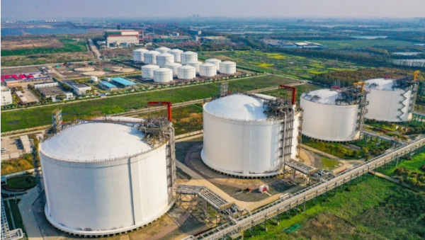

# 申能五号沟LNG接收站 - 申能集团

## 主要指标
|指标|数值|
|---|--------|
|**公司名称**|上海五号沟液化天然气有限公司|
|**电话**||
|**投资方**|上海燃气（集团）有限公司50%、申能股份50%|
|**注册资本**|5,000万(元)|
|**公司地址**|上海市浦东新区人民塘路485号1-9幢|
|**项目位置**|上海洋山深水港5号沟|
|**LNG储罐**|2万方 2x5万 2x10万|
|**保税**|无|
|**接收能力**|150万吨/年|
|**气化外输**|未知|
|**液态外输**|示知|
|**投产时间**|2008年|
|**2024年接卸**|132万吨|

## 简介

申能集团上海燃气旗下上海五号沟液化天然气有限公司（以下简称：五号沟公司）于2025年揭牌成立，成为上海燃气深化国企改革、优化产业布局的关键一步。

多年来，申能集团逐步构建起“X+1+X”上海天然气全产业链，并形成了上游“6+1”天然气多气源保障供应格局，为上海逾700万户燃气用户提供安全可靠稳定的天然气供应。其中，五号沟LNG站是多气源保障体系中的重要一环。

该站于1999年建成投运，当时建成了国内第一座LNG储罐——2万方LNG储罐，之后陆续扩建了2座5万方、2座10万方LNG储罐，形成总量32万方的LNG储存能力，可应急保障上海天然气供应15天。该站还建设了1座5万吨级LNG专用码头，成为全国第一座具有江海码头的LNG站。近年来，五号沟LNG站各项业务稳步发展，2024年共接收LNG船38艘。

此次五号沟公司揭牌成立，将承担起运营管理五号沟LNG站的重要职责，同时也标志着五号沟LNG站开始独立运营。公司将着力提升核心竞争力与清洁能源供给能力，不断深化与上下游企业的协同合作，在资源调配、技术共享上形成合力，保障能源供应的同时，服务国家“双碳”战略。

踏上发展新路，五号沟公司将对标行业一流企业，努力打造长三角LNG行业“示范窗口”，为长三角区域能源结构优化和绿色低碳转型贡献申能力量。

## 参考文献
[1.国内首座LNG储罐“焕新”启航，申能集团强化天然气供应保障](https://www.gzw.sh.gov.cn/shgzw_zxzx_gqdt/20250418/8bc9cca53b6a4bbabda347748d8fe390.html)
