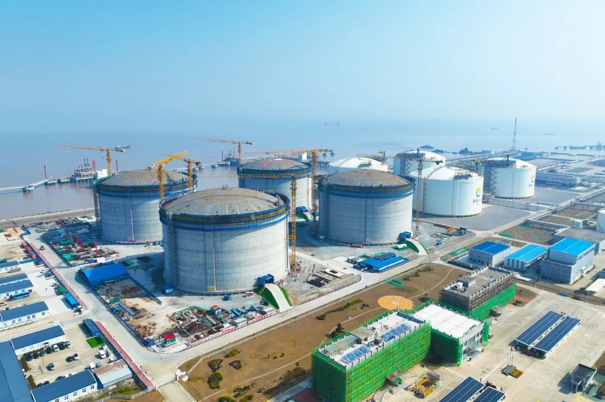

# 舟山LNG接收站 - 新奥

## 主要指标
|指标|数值|
|---|--------|
|**公司名称**|新奥（舟山）液化天然气有限公司|
|**电话**|0580-2103077|
|**投资方**|新奥（天津）能源投资有限公司90% Prism Energy International 10%|
|**注册资本**|205,600万(元)|
|**公司地址**|浙江省舟山经济开发区 新港工业园区4号楼409-2室（自贸试验区内）|
|**项目位置**|舟山经济开发区 新港工业园|
|**LNG储罐**|16万x4 22万x4(2025投)|
|**保税**|16万|
|**接收能力**|1000万吨/年|
|**气化外输**|0.2754|
|**液态外输**|0.2336|
|**投产时间**|2018年|
|**2024年接卸**|244万吨|

## 简介

新奥舟山LNG接收站是国家能源局核准的首个民营企业投资建设的大型LNG接收站，是国家和浙江省“十三五”“十四五”重点项目，是宁波舟山LNG登陆中心的重要组成部分。

项目一期于2018年8月建成投产，年处理能力300万吨；二期于2021年6月投产，年处理能力达到500万吨；三期新增建设4座22万立方米LNG储罐，在项目正式投运后，新奥舟山LNG接收站的LNG罐容能力由64万立方米增至152万立方米，处理能力将有望达到1000万吨/年。

三期项目投运后，舟山接收站在大幅提升保供能力的同时可满足长三角区域超3000万户家庭年用气需求，将有力提升接收站LNG资源承接和周转能力，以及浙江省、华东区域乃至全国的天然气应急保供能力和季节性调峰能力，还将助力浙江自贸区打造大宗商品全球资源配置基地，促进浙江省LNG登陆中心建设，服务地方经济发展。

2025年8月6日，随着首船LNG通过卸料臂注入三期项目7#储罐，舟山LNG接收站三期储罐及配套设施项目正式建成并投运。这座历时仅29个月建成，较计划提前4个月竣工，年接卸能力有望达1000万吨的超级能源枢纽，以国内首创的绿色调试工艺实现投产即减排的行业突破。

## 参考文献
[1.实探新奥舟山LNG接收站：构建多能互补体系 打造绿色示范标杆](https://www.news.cn/energy/20240704/d27c7b33eb854674b1170c0c78f7a2fe/c.html)

[2.新奥舟山LNG接收站三期项目正式投运 年接卸能力跃升至千万吨级](https://www.cnenergynews.cn/zjxj/2025/08/07/detail_20250807225841.html)
