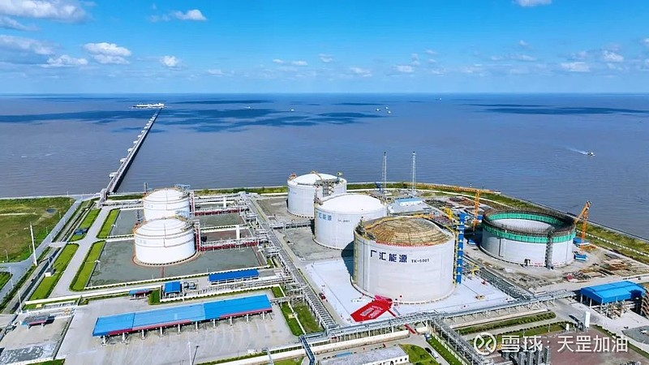

# 启东LNG储运站 - 广汇

## 主要指标
|指标|数值|
|---|--------|
|**公司名称**|广汇国际天然气贸易有限责任公司|
|**电话**|0513-83653119|
|**投资方**|广汇能源|
|**注册资本**|50,000万人民币(元)|
|**公司地址**|启东市吕四开发区石堤大道188号|
|**项目位置**|启东市吕四开发区石堤大道188号|
|**LNG储罐**|5万×2  16万×2 20万×2|
|**保税**|16万|
|**接收能力**|500万吨/年|
|**气化外输**|0.2020|
|**液态外输**|0.2020|
|**投产时间**|2017年|
|**2024年接卸**|76万吨|

## 简介

2017年，广汇能源启东LNG接收站投产运行，至今已建成LNG储罐6座，总罐容82万方，在冬季用气高峰时期，能够保障1200万户家庭连续1个月的用气量。

2024年建成的6#20万方LNG储罐，首次采用了“液氮+LNG混合预冷”的方式，相比5#20万方LNG储罐单独采用LNG预冷形式，可有效降低LNG消耗量、减少开车物料损耗约400万元，同时开创国内大型LNG储罐“混合预冷”的先河。投产前（ARKAT）靠泊启东LNG接收站卸载的14.23万方LNG全部进入6#储罐。至此，广汇能源启东LNG接收站总罐容由62万立方米提升至82万立方米，为“长三角”地区能源供给注入新的“底气”。

广汇能源综合物流发展有限责任公司董事长谭柏介绍：“2017年至今，广汇能源先后与卡塔尔、澳大利亚、俄罗斯等25个国家和地区的LNG资源地建立了合作关系。接收站已累计外输天然气超114.7亿方, 累计充装LNG车辆27.5万辆次，具备LNG槽车充装、LNG加注、城市管网输气、LNG高压气化输气等功能，为‘海气上岸’储存转运提供了便利条件。”

广汇能源启东LNG接收站正在规划建设7#20万方储罐和2号泊位。未来接收站将具备超1000万吨/年的周转能力，不仅能持续获取更多海外高性价比LNG资源，并为此提供仓储物流仓储服务，而且能够进一步发挥对区域终端市场供应、应急调峰及满足工业用气等综合性功能，助力广汇能源穿越能源周期，实现天然气业务的持续、稳步发展。

## 参考文献
[1.广汇能源启东LNG接收站6#20万方LNG储罐试生产](https://www.ts.cn/zxpd/xy/202405/t20240511_21207839.shtml)

