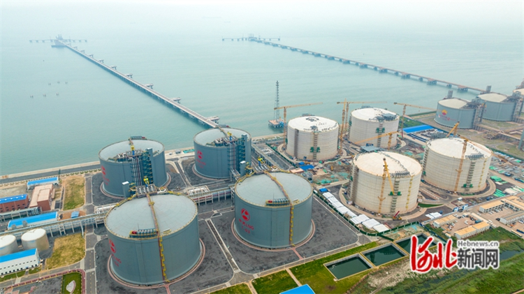
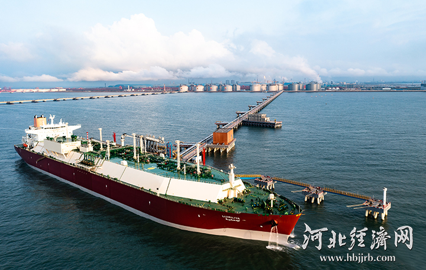

# 新天曹妃甸 - 新天

## 主要指标
|指标|数值|
|---|--------|
|**公司名称**|曹妃甸新天液化天然气有限公司|
|**电话**|0315-5078850|
|**投资方**|新天绿色能源股份有限公司51%   河北建设投资集团有限责任公司29%  唐山曹妃甸发展投资集团有限公司20%|
|**注册资本**|400,000万(元)|
|**公司地址**|曹妃甸工业区港口物流园区|
|**项目位置**|曹妃甸工业区港口物流园区|
|**LNG储罐**|20万×8|
|**保税**|-|
|**接收能力**|800万吨/年|
|**气化外输**|0.3310|
|**液态外输**|0.3310|
|**投产时间**|2023年|
|**2024年接卸**|132万吨|

## 简介

目前，河北省唐山市曹妃甸区新天LNG接收站项目建设正在按照建设节点要求稳步推进。据介绍，该项目是国家天然气产供储运体系重点工程，分三阶段建设。项目一阶段工程已于2023年6月份投产，年供气能力约70亿立方米；二阶段工程建设目前进入收尾阶段，三阶段工程正在加紧建设。项目全部建成投产后，将提高京津冀地区天然气应急调峰和供应保障能力。

## 参考文献
1.[唐山市政府网|曹妃甸新天LNG接收站项目建设稳步推进](https://www.tangshan.gov.cn/zhuzhan/bsxw/20250418/1629748.html)

