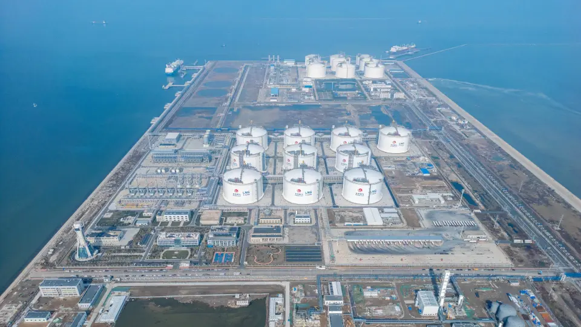
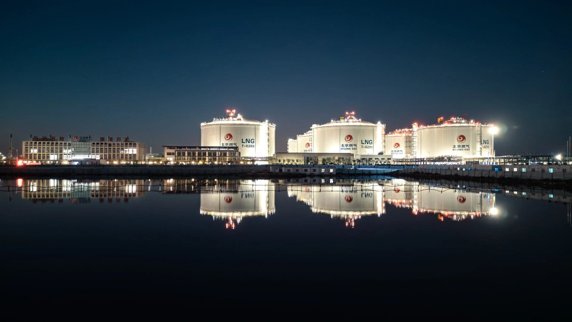

# 北燃天津LNG - 北京燃气

## 主要指标
|指标|数值|
|---|--------|
|**公司名称**|北京燃气集团（天津）液化天然气有限公司|
|**电话**|022-58681991|
|**投资方**|北京市燃气集团有限责任公司100%|
|**注册资本**|400,000万(元)|
|**公司地址**|天津开发区南港工业区|
|**项目位置**|天津开发区南港工业区|
|**LNG储罐**|20万×2 22万×8|
|**保税**|20万|
|**接收能力**|500万吨/年|
|**气化外输**|0.320|
|**液态外输**|0.320|
|**投产时间**|2023年|
|**2024年接卸**|184万吨|

## 简介

2024年11月25日，随着北京燃气天津南港LNG应急储备项目两座储罐高液位平稳运行，该项目三期工程实现投产进入试运行。至此，该项目一、二、三期全部建成投产，并全面转入生产运行阶段，项目储气能力不少于10亿立方米，将进一步发挥应急保供及应急调峰作用。

北控集团所属北京燃气集团建设的北京燃气天津南港LNG应急储备项目，是落实党中央、国务院相关要求的重要举措，是国家天然气产供储销体系建设的重要组成部分，也是首都能源保供及应急调峰项目。该项目按照“同期建设、分期投产”原则，共分三期进行，建设内容包括1座年接卸能力为500万吨、最大可靠泊26.6万立方米LNG运输船舶的LNG码头，另外还有10座LNG储罐、最大日气化能力为6000万立方米的气化设施及26台槽车装载设施、一条长217公里的天然气外输管线。

项目于2020年1月9日取得国家发展改革委批复，一期工程于2020年3月正式开工建设，2023年9月27日投产试运行。二期工程于2020年9月正式开工建设，2024年6月29日投产试运行。此前，项目一、二期已先后建成投运8座储罐、码头、配套外输设施及外输管道，此次三期工程2座22万立方米LNG薄膜储罐投产后，北京燃气天津南港LNG应急储备项目保供能力进一步得到提升，为首都采暖季等“高月高日”期间的天然气供应需求提供有力保障。

北京燃气天津液化天然气应急储备项目部副经理、北京燃气集团(天津)液化天然气有限公司副总经理张奕介绍，由于该项目下游用户对气质非常敏感，因此在投产前单独调配一储罐轻组分LNG用于三期工程储罐天然气置换与预冷，并且为了提升置换效果，开启高压补气。在投产储罐排放口检测到100%LEL甲烷后，启动气化外输，将蒸发气（BOG）增压外输与气化外输进行混合，以降低外输气中的氮含量。同时，为了监控三期工程储罐BOG品质，还安装了在线色谱监控。“项目三期投产实现了天然气置换达100%LEL后的‘零放空’，也实现了投产过程中外输气质优于国家一类气质标准的清洁投产。”张奕说。

“去年，北京燃气天津南港LNG接收站在首个冬季保供中发挥了重要作用。”北京燃气天津液化天然气应急储备项目部经理、北京燃气集团(天津)液化天然气有限公司总经理刘中河介绍，2023-2024年度保供期间，接收站顺利接卸8艘LNG船，卸载51万吨LNG，实现管道外输7.42亿立方米，完成槽车充装近7000辆。“尤其在去年12月中下旬极寒天气期间，最高日供气量达到2600万立方米，占北京市当日用气量的19%，发挥了应急储备调峰的重要作用。”刘中河说。

随着三期工程投产，北京燃气天津南港LNG应急储备项目全面转入生产运行，将大大提高京津冀地区天然气应急调峰和供应保障能力，为京津冀地区优化能源结构，发展低碳经济提供清洁能源保障。

## 参考文献
1.[北京燃气天津南港LNG应急储备项目三期工程投产进入试运行](https://news.qq.com/rain/a/20241125A0811L00)

