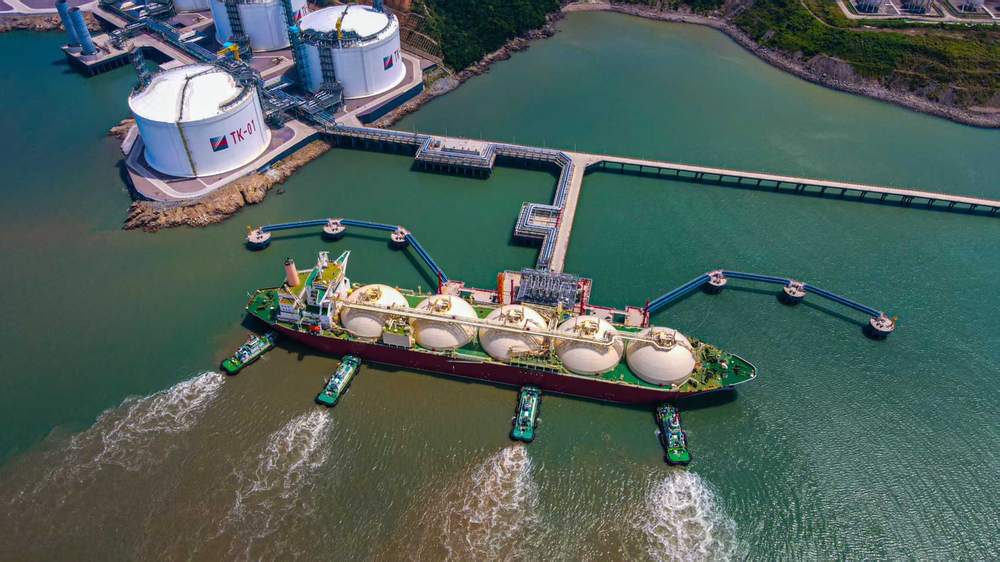

# 浙能温州 - 浙能集团

## 主要指标
|指标|数值|
|---|--------|
|**公司名称**|浙江浙能温州液化天然气有限公司|
|**电话**|0577-56886341|
|**投资方**|浙江能源天然气集团有限公司51% 中国石化天然气有限责任公司41% 温州大小门岛投资开发有限公司8%|
|**注册资本**|252,928万(元)|
|**公司地址**|浙江省温州市洞头区大门镇小门路316号|
|**项目位置**|浙江省温州市洞头区大门镇小门路316号|
|**LNG储罐**|20万×4|
|**保税**|-|
|**接收能力**|300万吨/年|
|**气化外输**|-|
|**液态外输**|-|
|**投产时间**|2023年|
|**2024年接卸**|102万吨|

## 简介

浙能温州液化天然气（LNG）接收站项目配套15万吨级码头，是浙南地区迄今为止建设规模最大、泊位吨级最高的液化天然气码头，可靠泊接卸世界最大26.6万立方米液化天然气船，泊位设计通过能力634万吨/年。在试运营期间（至2025年9月），该码头共有35艘LNG船舶进港，接卸液化天然气220.9万吨（合30.47亿立方米），总产值达92.78亿元，可替代煤炭400万吨、减少二氧化碳排放约840万吨。

项目包含25公里外输管道，设计输气规模135亿立方米/年，在乐清站接入国家管网集团旗下浙江省天然气管网。

## 参考文献
1.[温州交通局|浙能温州LNG接收站项目配套码头工程通过竣工质量鉴定](https://wzjt.wenzhou.gov.cn/art/2025/9/2/art_1692211_58931901.html)

