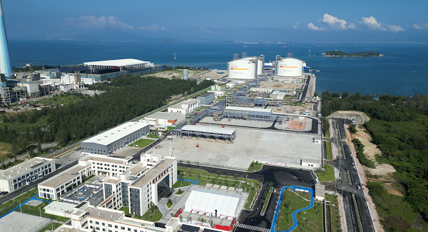

# 广能惠州LNG - 广东能源

## 主要指标
|指标|数值|
|---|--------|
|**公司名称**|广东惠州液化天然气有限公司|
|**电话**|0752-6590023|
|**投资方**|广东能源集团100%|
|**注册资本**|229249.427万元|
|**公司地址**|广东省惠州市惠东县平海镇碧甲村白沙湖地段|
|**项目位置**|广东省惠州市惠东县平海镇碧甲村白沙湖地段|
|**LNG储罐**|20万×3 27万x3（在建）|
|**保税**|-|
|**接收能力**|610万吨/年|
|**气化外输**|-|
|**液态外输**|-|
|**投产时间**|2024年|
|**2024年接卸**|-|

## 简介

惠州LNG接收站项目是广东省2024年重点建设项目，由广东能源集团所属惠州液化天然气公司负责建设。项目一期工程建成并投运3座20万立方米LNG储罐及相关配套接卸、气化、外输等设施，以及1座8万至26.6万立方米LNG船舶接卸码头，设计接卸天然气规模为400万吨/年，最大接收能力为610万吨/年；

2024年9月核准的二期项目业主为广东惠州液化天然气有限公司，为广东能源集团天然气公司的全资子公司，负责项目的投资、建设和运营管理。项目建设地点为广东省惠州市惠东县平海镇，在已建的惠州LNG接收站一期厂区内实施扩建。主要新增3座27万立方米全容LNG储罐及配套设施，最大处理能力增加至745万吨/年。

## 参考文献
1.[广东发改委.20240924.|关于惠州LNG接收站项目二期工程核准的批复](https://drc.gd.gov.cn/xmgg/content/post_4499041.html)

2.[国资委|广东能源集团在惠天然气产业链一体化项目投运](http://www.sasac.gov.cn/n2588025/n2588129/c31865746/content.html)

