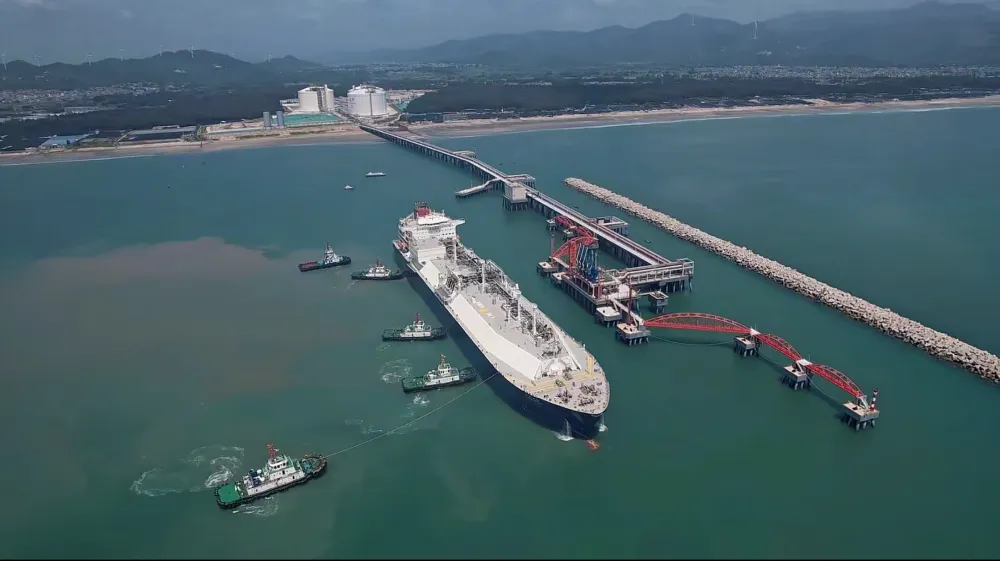
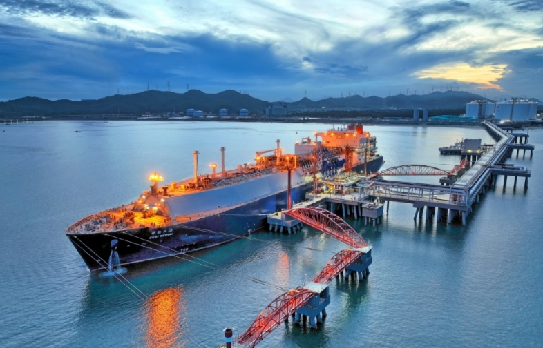

# 华瀛潮州LNG - 中石化

## 主要指标
|指标|数值|
|---|--------|
|**公司名称**|华瀛天然气股份有限公司|
|**电话**|15975191584|
|**投资方**|中石化50%、华瀛投资控股集团50%|
|**注册资本**|169,151万元|
|**公司地址**|饶平县潮州港经济开发区新能源产业园|
|**项目位置**|饶平县潮州港经济开发区新能源产业园|
|**LNG储罐**|20万×3|
|**保税**|-|
|**接收能力**|600万吨/年|
|**气化外输**|-|
|**液态外输**|-|
|**投产时间**|2024年|
|**2024年接卸**|-|

## 简介

华瀛LNG接收站是国家和广东省“十三五”能源规划重点建设项目，位于广东潮州港经济区，由中国石化天然气有限责任公司和华瀛投资控股集团有限公司合资建设。项目分两期建设，本次投入运营的一期工程共有3座20万立方米LNG储罐、1个LNG运输船接卸泊位及相关配套设施，年接转能力达600万吨、年供气能力达88亿立方米，可满足近4900万户家庭一年的用气需求。未来二期工程建成投用后，华瀛LNG接收站年接转能力将提升至1200万吨，成为广东省最大的天然气储备和供应基地。该项目的成功投运将有效助力广东省延伸天然气产业链，还将提升粤东地区乃至粤港澳大湾区的天然气调峰保供能力，对优化能源结构、推进绿色低碳转型、助力区域经济发展具有重要意义。

外输管道59公里，设计输气规模70亿立方米/年，连接至粤东天然气主干管网及西三线闽粤支干线。

## 参考文献

1.[能源局|中国石化华瀛LNG接收站在广东投用](https://www.nea.gov.cn/2024-09/13/c_1310786102.htm)

