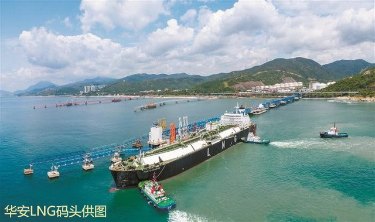

# 深圳华安LNG - 深圳燃气

## 主要指标
|指标|数值|
|---|--------|
|**公司名称**|深圳华安液化石油气有限公司|
|**电话**|89770012|
|**投资方**|深燃集团100%|
|**注册资本**|169,151万元|
|**公司地址**|深圳市大鹏新区葵涌街道深葵路70号|
|**项目位置**|深圳市大鹏新区葵涌街道深葵路70号|
|**LNG储罐**|8万×1 16万×2（在建）|
|**保税**|-|
|**接收能力**|100万吨/年|
|**气化外输**|-|
|**液态外输**|-|
|**投产时间**|2019年|
|**2024年接卸**|2|

## 简介

华安LNG项目是深圳市能源战略储备的重点工程，于2014年8月开始建设，包含有一座264米LNG码头、一座8万立方米的LNG全容储罐、5套LNG装车台、蒸发气压缩机和24万立方米/小时的高压气体外输设施，年加工能力80万吨。

2019年8月18日，一艘载有6.5万立方米液化天然气的LNG船舶“LNG PORTOVENERE”轮顺利靠泊深圳华安LNG码头，标志着该LNG码头正式投入运营。这是继广东大鹏LNG接收站、深圳中海油LNG接收站之后，深圳大鹏湾LNG枢纽港投入运营的第三座LNG接收站。

该项目的投入运营，将极大增强深圳城市管网的应急调峰能力，可满足深圳市天然气调峰和7天的应急储备要求。且该项目可通过深圳燃气管网与广东省燃气管网连接，凭借国际天然气自主采购权、自有码头、多元化采购渠道和优越的地理位置，有效服务粤港澳大湾区城市群，进一步发挥其重要的能源枢纽作用。

外输管道连接至深圳市城市燃气管网。

## 参考文献

1.[深圳港口协会|深圳华安LNG码头投入运营](https://www.nea.gov.cn/2024-09/13/c_1310786102.htm)

