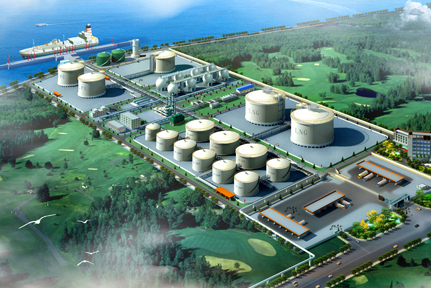

# 东莞九丰 - 九丰

## 主要指标
|指标|数值|
|---|--------|
|**公司名称**|东莞市九丰天然气储运有限公司|
|**电话**|0769-82795119|
|**投资方**|广东九丰能源集团有限公司80% 东莞市九丰能源有限公司20%|
|**注册资本**|26,000万(元)|
|**公司地址**|广东省东莞市沙田镇䲞沙大道27号101房|
|**项目位置**|广东省东莞市沙田镇䲞沙大道27号101房|
|**LNG储罐**|8万×2|
|**保税**|-|
|**接收能力**|100万吨/年|
|**气化外输**|-|
|**液态外输**|-|
|**投产时间**|2012年|
|**2024年接卸**|-|

## 简介

自2020年2月起，九丰向当地一座200MW的燃气热电联产项目以气化外输的形式供气。

九丰能源发家于广东东莞，最早的主营业务为LPG销售。

依托在珠江旁边的东莞立沙岛综合能源基地及码头，九丰能源形成强大的LPG 储配与销售网络，年销售量接近200万吨，连续多年成为华南区域主要的LPG进口商和分销商之一，位居国内前十大LPG进口商之列。

2006年，中国内地第一座接收站大鹏接收站在广东深圳大鹏正式投产，大鹏接收站空前成功，也让包括三大油在内的一批玩家蠢蠢欲动，均想进入接收站这个行当中。

九丰能源也不例外，其时LNG接收站在国内刚刚兴起，民营企业想入局谈何容易，但九丰手里捏着东莞立沙岛LPG码头，不必为码头岸线和土地等资源发愁，具备先天优势条件。

2008年1月九丰能源成立了东莞市九丰天然气储运有限公司，专注于液化天然气（LNG）的全产业链各环节业务，包括海外采购、海外运输、国内接收及仓储、国内销售以及相关金融衍生产品业务，最重要的是筹备改造建设九丰LNG接收站，九丰计划在立沙岛上建设两个8万方的LNG储罐同时改造码头接卸通道。

4年后，2012年6月，东莞九丰LNG接收站开车运行，设计年周转能力100万吨，不过由于处在珠江上，岸线资源条件受限，最大只能接卸5万吨级的小船，九丰只能依托马石油、印尼等进口LNG资源。

2016年，九丰与马石油签订了每年60万吨的短协，为期5年，九丰的LNG业务开始进入快车道，不仅仅是接收站运营、LNG进口销售，同时还发力国内LNG贸易。此外，九丰还与意大利ENI签了长协。

根据九丰介绍，九丰的长协既有与BRENT原油期货价格挂钩的，也有传统与日本原油清关价格JCC挂钩的。

在接收站改造投产后，九丰已成为专注于燃气产业中游及终端领域的大型清洁能源综合服务提供商，经营产品包括液化天然气（LNG）、液化石油气（LPG）等清洁能源以及甲醇、二甲醚（DME）等化工产品，主要应用于燃气发电、工业燃料、城镇燃气、汽车燃料、化工原料等领域。

在生意越做越大后，九丰谋求国内A股上市的渴求越来越强烈。

2018年，原在广东的九丰能源将注册地迁移至江西赣州，注册成立江西九丰能源股份有限公司。

为啥突然从东莞转战到较偏僻的江西赣州？只因为为了支持脱贫攻坚，证监会将国内一些相对经济落后的地方设立资本上市绿色通道，包括之前提到过的新疆，江西赣州作为革命老区也在之列，九丰为了上市也是拼尽所有。

2019年，九丰聘请了国内在上市领域最牛逼的中金公司作为保荐机构，正式向证监会提交了上市申请。

不过好事多磨，九丰上市之路并非一路顺风，经过数轮折腾之后，2021年4月23日，证监会终于通过了九丰能源的上市申请。

## 参考文献

1.[燃气网|屡败屡战！国内首座民营LNG接收站终上市！](https://gas.in-en.com/html/gas-3538450.shtml)

