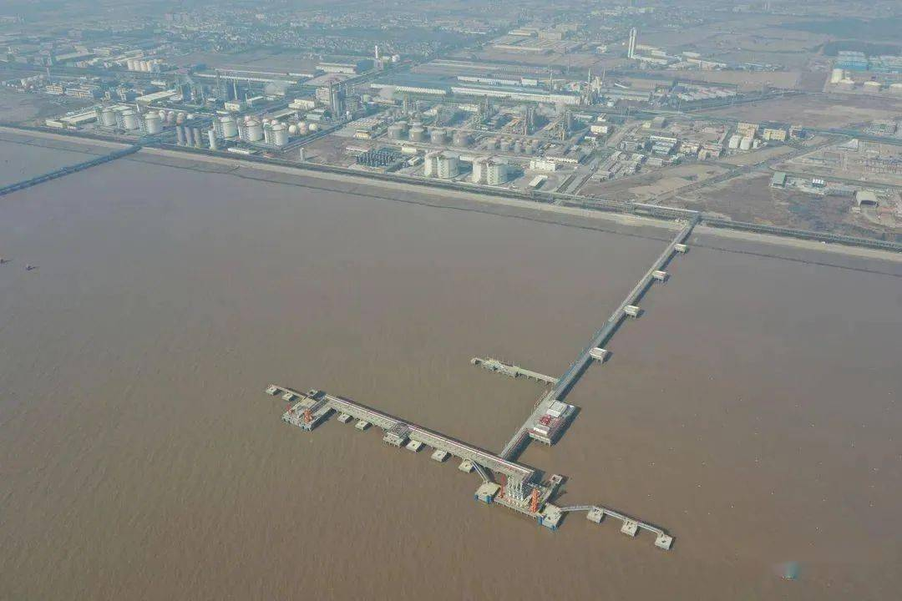

# 杭嘉鑫平湖LNG - 浙江杭嘉鑫

## 主要指标
|指标|数值|
|---|--------|
|**公司名称**|浙江杭嘉鑫清洁能源有限公司|
|**电话**|82219800|
|**投资方**|嘉兴燃气51%、杭州燃气49%|
|**注册资本**|70,0000万(元)|
|**公司地址**|浙江省嘉兴市平湖市独山港镇通港路2号|
|**项目位置**|浙江省嘉兴市平湖市独山港镇通港路2号|
|**LNG储罐**|10万×2|
|**保税**|-|
|**接收能力**|100万吨/年|
|**气化外输**|-|
|**液态外输**|-|
|**投产时间**|2022年|
|**2024年接卸**|54万吨|

## 简介

嘉兴LNG接收站包括库区工程、码头工程和外输管线工程三个部分。储运站设计LNG年周转量100万吨。 库区工程包括：2座10万方混凝土全容储罐、工艺设施及辅助设施； 码头工程包括：嘉兴港独山港区A区的A7和A泊位位置新建两个LNG泊位，A7泊位设计船型为3万GTLNG船，A8泊位设计船型为5000GTLN船；外输管线与浙江省网和嘉兴市网连接。

据了解，这是继 上海燃气、深圳燃气之后 全国第3家城市燃气企业投产的LNG接收站，可直接开展海外LNG贸易业务。这也是继 宁波LNG接收站、舟山LNG接收站之后， 浙江省投入运营的第3座LNG接收站。

浙江嘉兴LNG应急调峰储运站是浙江省天然气产供储销体系的重要组成部分，是杭燃集团全产业链布局的重要一环，是民生工程、安全工程、绿色工程、温暖工程。 该储运站于2018年3月开始建设，总投资24亿元，包括库区工程、码头工程和外输管线工程，设计LNG年接卸量100万吨。

2022年7月18日下午16点，一艘来自 马来西亚民都鲁港，载有 4.5万立方米LNG的船舶“LNG JIAXING”轮安全靠泊在浙江嘉兴港的 独山港区液体散货作业区，标志着由 嘉燃集团和杭燃集团共同投资建设的 浙江嘉兴LNG应急调峰储运站正式投运。

平湖LNG外输管道54 km，设计输气规模8亿立方米/年，连接嘉兴市域管网与至浙沪联络线工程.

## 参考文献

1.[浙江嘉兴LNG应急调峰储运站：第23座，正式投运！迎来首船4.5万方LNG（附项目历史进程） ](https://www.sohu.com/a/573800961_121123883)

