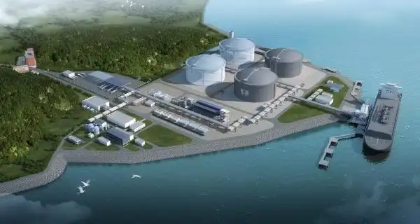

# 广燃南沙LNG - 

## 主要指标
|指标|数值|
|---|--------|
|**公司名称**|广州发展天然气贸易有限公司|
|**电话**|020-37852168|
|**投资方**|广州发展液化天然气投资有限公司100%|
|**注册资本**|50,000万(元)|
|**公司地址**|广州市南沙区黄阁镇华耀街1号903房（仅限办公）|
|**项目位置**|广州市南沙区黄阁镇华耀街|
|**LNG储罐**|16万×2|
|**保税**|-|
|**接收能力**|100万吨/年|
|**气化外输**|-|
|**液态外输**|-|
|**投产时间**|2023年|
|**2024年接卸**|48万吨|

## 简介

项目分两阶段实施：一期工程于2021年4月完成储罐气顶升作业，建造2座16万立方米LNG储罐及配套码头，2022年8月获批建设配套管线工程。二期工程于2022年11月备案，新增2座16万立方米储罐，总投资17.02亿元，建成后总储量达64万立方米。

## 参考文献

1.[浙江嘉兴LNG应急调峰储运站：第23座，正式投运！迎来首船4.5万方LNG（附项目历史进程） ](https://www.sohu.com/a/573800961_121123883)

