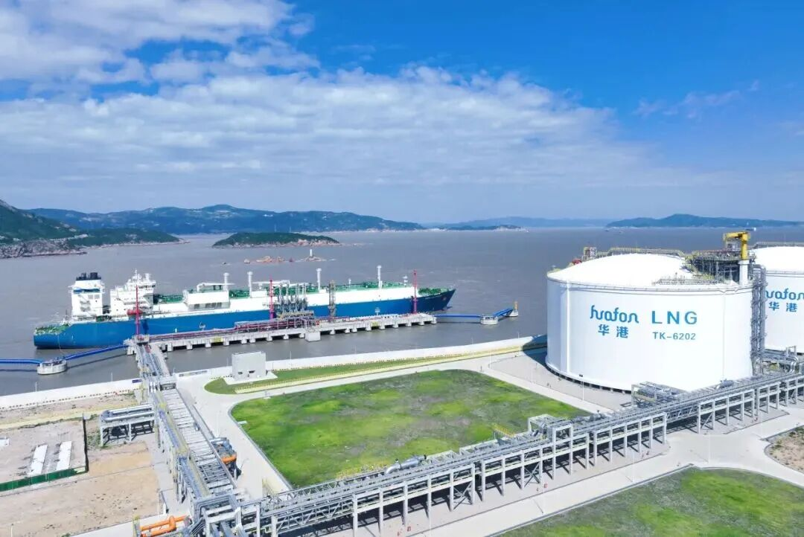

#  

## 主要指标
|指标|数值|
|---|--------|
|**公司名称**|温州华港石化码头有限公司|
|泊位|1x10万总吨｜
|船型|最大靠泊船型为18.2万m^3^ LNG船舶（船舶长度≤300 m）|
|**电话**|0577-63488590|
|**投资方**|华峰集团|
|**注册资本**|3.8亿|
|**公司地址**|浙江省温州市洞头区|
|**项目位置**|浙江省温州市洞头区|
|**LNG储罐**|16万×2|
|**保税**|-|
|**接收能力**|100万吨/年|
|**气化外输**|-|
|**液态外输**|-|
|**投产时间**|2025年10月|
|**2025年接卸**|-|

## 简介

温州华港LNG项目位于温州港状元岙港区C作业区，总投资达106亿元。一期工程投资28亿元，建设1座10万吨级码头、2座16万立方米LNG储罐及20套LNG槽车装车撬，年周转规模300万吨，预计年营业收入可达100亿元。

项目全部建成后，预计年周转规模将达到1000万吨，年营业收入超过300亿元，将全面带动浙江省及温州地区天然气产业发展，极大增强浙南地区天然气应急保供能力，推动区域能源结构清洁化转型。

## 参考文献

1.[首船安全靠泊！温州华港LNG（液化天然气）储运码头正式启用](https://wzjt.wenzhou.gov.cn/col/col1243910/art/2025/art_9abea8fa874c126a4823563a106ea0c4.html).2025-10-28.洞头发布

