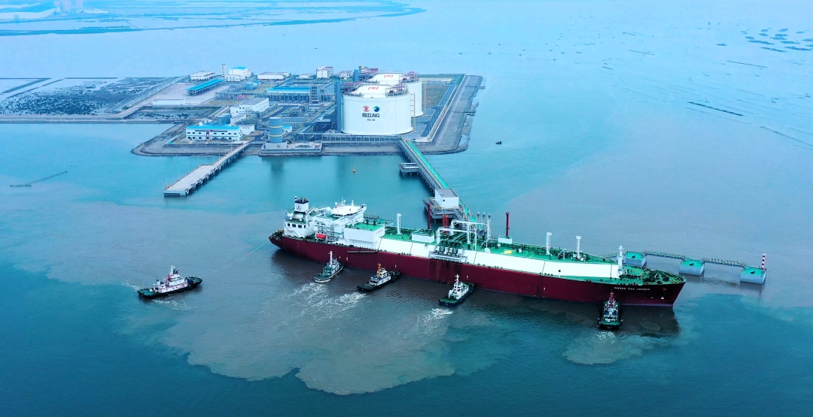

# 阳江LNG

## 主要指标
|指标|数值|
|---|--------|
|**公司名称**|广东阳江海陵湾液化天然气有限责任公司|
|**电话**|0662-3929896|
|**投资方**|广东省能源集团天然气有限公司、新加坡金鹰集团太平洋能源有限公司|
|**注册资本**|1.42亿美元|
|**公司地址**|阳江高新技术产业开发区阳江港吉树港区疏港大道2号北院103室|
|**项目位置**|阳江高新区阳江港22号码头泊位|
|**LNG储罐**|16万×2|
|**保税**|-|
|**接收能力**|280万吨/年|
|**气化外输**|-|
|**液态外输**|-|
|**投产时间**|2025-11-21|

## 简介

项目一期建设2座16万方全包容LNG储罐，一座可靠泊0.8万到17.5万方LNG船舶装卸码头，年处理能力达280万吨，折合天然气约40亿标准立方米。同期配套41.5公里外输管道接入广东省管网。项目集LNG接卸储存、气态外输、槽车外输、返装船、应急调峰等多业务、多功能于一体，运营灵活性较强。

## 参考文献

1.[阳江LNG调峰储气库项目首船靠泊成功](http://www.yjgx.gov.cn/gnlm/sylbt/content/post_907507.html).2025-11-21.阳江高新区

2.[【省重点项目】首船靠泊成功！阳江LNG调峰储气库项目投入试生产](https://gzw.gd.gov.cn/gkmlpt/content/4/4803/post_4803491.html#1333).2025-11-21.广东省人民政府国有资产监督管理委员会.758336165/2025-01340