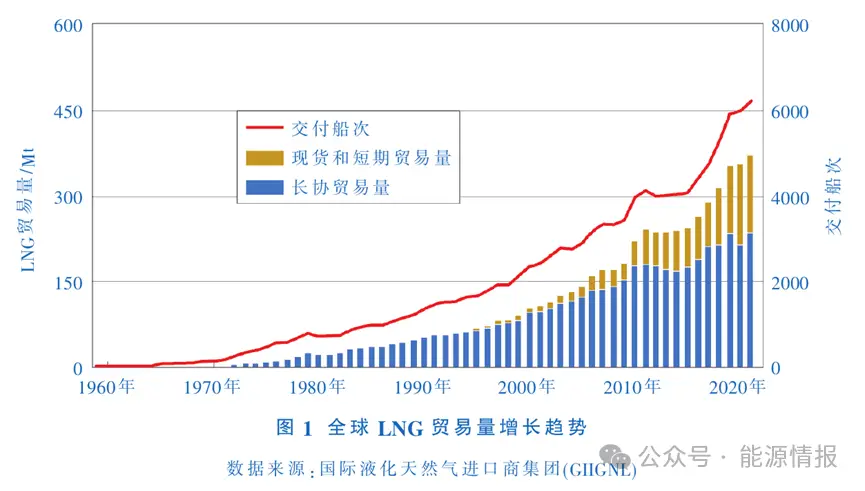
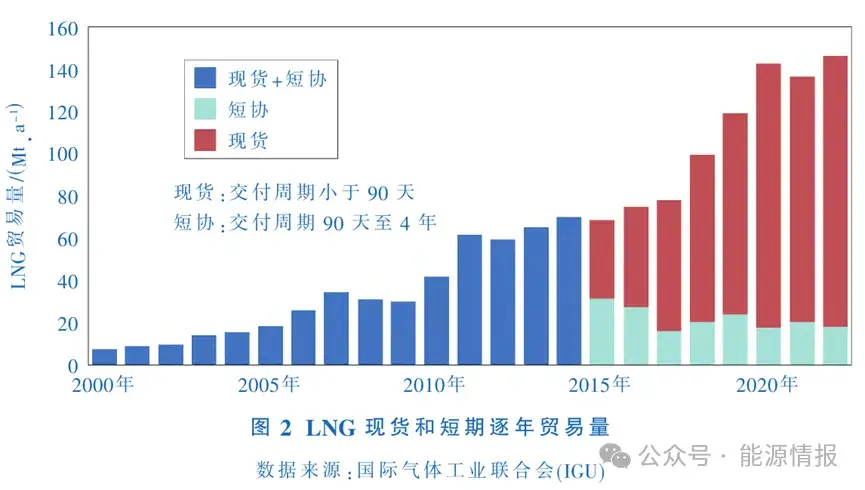
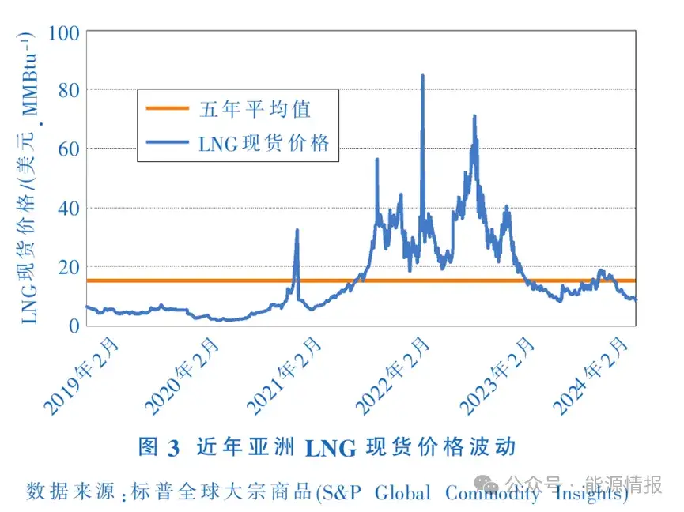
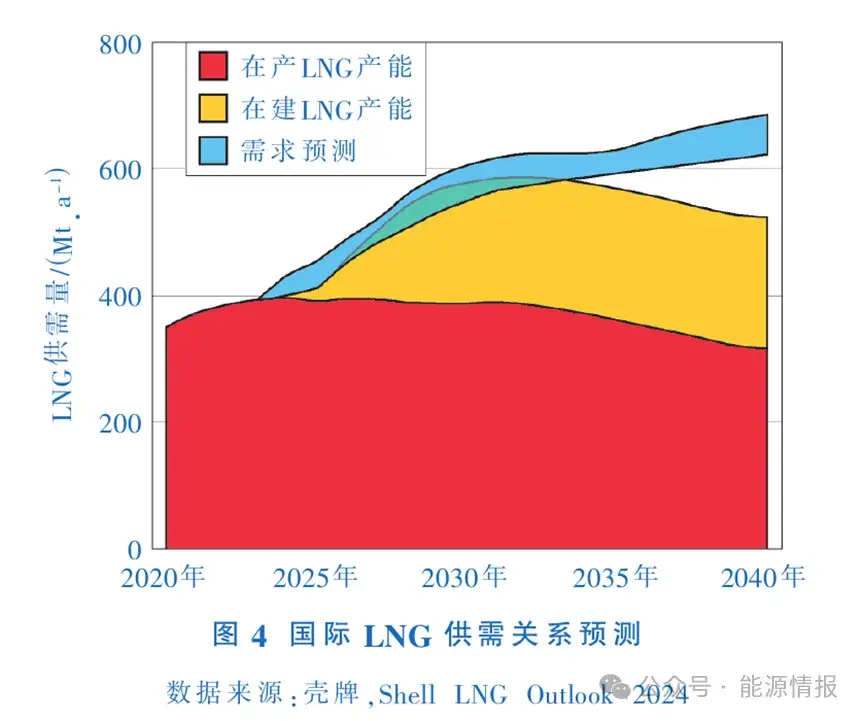

# LNG国际贸易合同变化趋势 

作者: 周颖/广东能源集团天然气有限公司/中外能源

[原文](https://www.sohu.com/a/802826866_121119270)

## 1 前言

从1964年“甲烷公主号”首次商业交付算起，液化天然气(LNG)的国际贸易已走过60年的历史。在过去的60年间，全球液化天然气贸易量长期保持增长态势(见图1)，平均每年增长11%，从1971年的260万t增长到2023年的4.04亿t，期间40%的年份实现了超过两位数的增长率，全球40多个国家/地区参与了LNG市场贸易。

近年来，随着新一轮世界能源变革，国际液化天然气市场正经历着深刻变化。受世界经济发展、产业结构调整、天然气资源和替代能源竞争等诸多因素的影响，国际液化天然气市场的供需、格局和价格出现了新的趋势。国际政治经济形势变幻莫测，叠加疫情时代和战争频发，LNG国际市场的周期变换也出现加速转变的趋势。与此同时，LNG上下游项目的商业模式、合同架构等诸多方面都经历了若干演化。

## 2 LNG国际贸易合同历史特点

### 2.1 LNG长协贸易的历史特点

自LNG出口项目运营以来，在相当长的时间内，LNG国际贸易以长期合同(Long-Term Contract，简称“长协”)为主。其特点是从出口设施到进口设施的“点对点”供应，并且通过签署LNG购销协议(SPA)的形式约定买卖双方的权利和义务。

天然气上游的勘探开发以及天然气液化设施建设投资巨大，卖方为了控制项目投资的风险，在项目投资决策前一般为了锁定下游稳定的需求，同时根据“照付不议”条款去锁定资金回收，通过签署多份“长协”SPA对项目予以支撑，在贸易模式选择上多采用目的港船上交货(DeliveredEx-Ship，DES)的模式，在抵达目的港之前的权责由卖方承担，合同周期多为20年。相应的，对买家的条款约束较多，条款灵活性差，“目的地条款”限制，强调点对点供应，合同气量中可上下浮气量比率非常低(通常只有5%)，同时对买方还有严格的限制条件和补足义务。

LNG国际贸易长期以来处于供需失衡的状态，买家一般首要考虑保障能源供应的稳定性，因此通常也接受严格的合同条款。同时为了追求规模效益，单次采购量大，一般超过100万t/a。由于量大且灵活性较差，买方承担着较大的市场风险。

价格公式是LNG贸易合同中的关键因素，通常与竞争燃料价格挂钩，直线价格公式与“S曲线”价格公式相对来说更能满足买卖双方对减少价格波动的要求。国际LNG贸易按照区域性分为美国、欧洲和亚洲三个市场，每个市场都有自己的定价方法和特点。传统的LNG贸易合同挂钩的价格指数较为单一，多与油价挂钩。在美国，LNG的竞争能源是管道天然气，其价格主要受亨利枢纽(Henry Hub)的天然气合同价格的影响。在欧洲，LNG价格通常参考其他竞争燃料价格，例如汽油等。亚洲地区合同定价多与日本进口原油加权平均价格(JCC)挂钩，但由于灵活性差等原因，出现“亚洲溢价”现象，使亚洲LNG到岸价在三个区域市场中处于高位。

### 2.2 LNG现货/短期贸易的历史特点

为了利用价格差异进行套利交易，欧洲和美国天然气市场率先开展了LNG现货和短期贸易，欧美成熟的天然气市场为LNG现货和短期套利交易的发展提供了条件。20世纪80年代后，美国高度自由化的市场逐步发展起来；英国NBP(国家平衡点)指数于1996年成立，并在2005年之后逐渐变得活跃；荷兰的天然气市场随着欧盟的整体自由化改革始于2000年左右，并于2003年成立了TTF(Title Transfer Facility)指数，历经10年改革，成为欧洲最大的交易中心。亚洲地区虽然发展相对较慢，但在20世纪90年代中后期，日韩等国逐渐开始利用LNG现货和短期贸易合同，解决严寒天气及冬夏巨大峰谷差的调峰等问题，同时由于上游天然气资源可能的供应不足，燃气机组停机也导致了亚洲LNG现货和短期贸易量的涌现。

LNG现货/短期贸易双方通常先签订一个主合同(Master Sales and Purchase Agreement)，将交易的各项通用合同条款锁定，等到有实际交易发生时再签订一个确认函(Confirmation Notice)以明确交易的LNG货量、价格、供货时间、质量、装载港、卸载港、LNG船等个性化条款，主合同和确认函同时构成一份完整的合同。因为受上游LNG船期安排、航运时间、接收站的LNG库存管理以及下游用气周期等因素的影响，双方一般需要在交货窗口期前的30～60天商定确认函的细节。

## 3 LNG国际贸易合同现状分析

### 3.1 LNG长协贸易现状分析

近年来，天然气市场不断受到各国能源战略调整、经济形势、替代能源价格波动、碳减排政策、地缘政治、战争等突发事件的影响，全球LNG贸易格局重塑加快，因此对贸易模式也要求越发灵活，亚洲需求增长和新兴市场的参与都将对LNG贸易产生深远影响。LNG市场参与者需要根据市场变化做出相应的调整，以面对未来市场的机遇和挑战。买方开始积极参与上游投资，卖方也开始进入下游市场。这种纵向产业链的延伸使得市场参与者可以及时掌握市场动向，加强风险应对和抗风险的能力。

越来越多的LNG长协DES交易采取了更为灵活的方式，保障能源供应的同时要求更多灵活性，主要表现在以下几个方面：

一是合同周期变短，大多为10～15年左右，很少有超过20年的合同出现。

二是单个合同采购量变小，大多为100万t/a或采用渐增期等方式进行。

三是“照付不议”条款的灵活性更高，对应为互换转售机制或者利益分成的机制，互换转售操作一般在双方供需产生互补、双方通过缩短船运距离来减少船运成本时，或存在套利空间时出现，互换转售交易的发生可以分散风险。合同气量中可上下浮气量比率在10%～30%左右，同时拥有转运条件和补提权力，甚至部分合同增加了部分气量价格随行就市的设置。

四是买方在合同机制上尽量规避价格风险和气量风险，如目的地条款可协商、DES交货增加了多个接收点等，同时在长期合同中设定每3～5年重新回顾价格条款，以降低双方的价格风险。

价格公式上除了与原油指数(Brent)挂钩外，与天然气指数HenryHub、TTF、JKM(普氏日韩标杆指数)等挂钩也比较常见，近年来采用油价和气价的组合指数公式也成为一种选择，甚至选用电力库指数等。通常在低油价背景下，LNG贸易合同一般采用与油价挂钩的定价方式，此时气价指数的竞争力降低，而高油价情景下则相反。在价格公式中对于原油价格的上下限也是协商调整机制。

此外，LNG长协贸易采用离岸价FOB(FreeOnBoard)的交易模式愈发增多。卖方只需在装运港船上提供货物给买方，交付点为装运港船上交付，卖方承担在此之前的费用和风险。这种模式可以使买方在船运调度上掌握主动和灵活性，但增强了对买家航运能力的要求，特别是LNG运输船市场造价水平以及管理人员的要求，同时受船运技术发展和环保要求的影响也较大。

### 3.2 LNG现货和短期贸易现状分析

随着基础设施公平开放逐步落实，参与国际天然气市场的进口LNG贸易主体增多，特别是城市燃气和发电企业的深度参与，这些企业贴近市场前端、充分了解用户需求、运营成本更明朗，且没有高价长协贸易合同的历史负担，具有更强的竞争灵活性和竞争优势。国际巨头们也纷纷转型至资源池供应商的角色，拥有强大的资金支持和抗风险能力，有些在上游项目投资决策前未锁定销售的货量或项目后期产能增加出现的富余量，均流向LNG现货和短期贸易市场。这些都促进了LNG现货和短期贸易的繁荣和变化，也使得LNG市场更加透明，增加了市场流动性。但同时，LNG现货和短期贸易对买卖双方的船期安排和罐容管理提出了更高的要求。

近年来，LNG现货贸易呈现稳步增长的态势，截至2022年年底，LNG现货和短期贸易量超过了1.4亿t(见图2)，达到全球LNG总贸易量的35%。

LNG现货贸易交易谈判时间呈现“短频快”的趋势，决策时间短、谈判频率高、市场情况变化快。货源和货量的多元化，与消费端的应急需求得以更好地匹配。现货贸易合同年限一般在一年内，货量为一船或者多船。短期贸易合同年限一般在2～5年内，货量明确每年的船数，趋向标准船舶以便于转售及船岸匹配。

在价格方面，LNG现货价格变化快、幅度大，例如2022年3月7日亚洲LNG现货价格破历史纪录达到84.76美元/MMBtu(1Btu=1055.06J，下同)，仅一天后又跌至54.28美元/MMBtu(见图3)。但是总体而言，LNG现货和短期贸易合同灵活度高，更有利于买家规避未来市场周期性变化所带来的风险，也因此在目前多变且主体增多的市场环境大背景下，LNG现货和短期贸易合同更受青睐。

## 4 LNG国际贸易市场发展预测

国际石油公司看好未来中长期LNG消费市场发展前景，跨国油气集团壳牌(Shell)在其最新年度LNG展望报告中预测，到2040年，全球LNG需求预计将增长50%以上(见图4)，其中中国、南亚及东南亚国家的天然气需求增加是主要驱动力。虽然中长期发展前景看好，但短期内，在世界经济增长复苏乏力、美国限制LNG项目出口审批、欧洲地缘政治冲突和巴以冲突等区域性地缘风险持续扩大，以及全球性环境与气候治理加强等因素的共同影响下，全球LNG需求量难以出现大幅增长，预计市场将进入供需平稳新阶段。

从供给方看，卡塔尔、阿曼和美国是2023年新签合同的主要来源，签约规模分别为1700万t/a、1100万t/a和3000万t/a。从需求方看，2023年我国新签长协合同规模约为1500万t/a，与2022年基本持平；欧洲2023年新签长协合同规模小幅增至1550万t/a；而受价格波动等因素影响，2023年南亚和东南亚买家新签长协合同规模超过700万t/a。2023年全球LNG接收站新建产能为5000万t/a。

从价格的角度来看，在经历了2022年欧洲地缘政治冲突等地缘风险导致的气价大幅上涨后，2023年全球天然气和LNG市场价格均呈现出较大幅度的下行波动走势，欧洲TTF现货均价较2022年下跌了63%，亚洲LNG现货均价较2022年下跌了55%。2024年初，全球LNG现货价格呈现持续下跌的趋势，近期亚洲LNG现货价格触及近三年低点。由于LNG价格保持在低位，LNG现货交易的活跃度正在回升。

在国内天然气供应方面，根据壳牌和澳大利亚第一大液化天然气(LNG)出口企业伍德赛德公司等预测，2024年中国LNG进口量将从2023年的大于7000万t反弹至8000万t，超过2021年创纪录的7879万t。但需求增长也将取决于LNG价格、煤炭和可再生能源的使用，以及国内生产情况和管道气进口情况。2024年中国天然气总供应量预计为4184亿m3，同比增长6.14%。

进口方面，中俄东线天然气管道将于2025年全面投产，中俄中线计划2024年开始建设，2027年投产，未来俄气份额将继续提升；中国买家新签的进口LNG长协预计有10份将开始执行，长协合同量约为612万t。在国产气持续增长、中俄东线管道气按合同增加供应以及LNG进口量恢复性增长等条件下，预计我国天然气供应将相对宽松，国内天然气采购价格将基本延续稳定。

## 5 建议

①预计短期内我国天然气市场将进入供需平稳新阶段，应适时开展天然气优化策略，利用进口气和国产气的配合，寻找最大价值的优化。提高对LNG市场的敏感性，同时警惕由于套利价差等原因造成的违约事件或者不可抗力事件，重视长协、中短期和现货合同的匹配度，做好基础设施的配合和协调。

②建议有能源保障压力的相关企业采取以长协合同为主、积极发展现货和短期贸易合同为辅的策略，动态匹配窗口期，利用月间价差或者窗口错配调剂等策略优化价值。在长协贸易合同采购时需要清晰明确目的，若是为了弥补供应缺口，则必须基于需求量寻找可靠的供应商，并争取有利的价格条款。若是为了侧重规避长期协议带来的风险，则在谈判时应舍去部分价格获得更多的灵活性条款。当考虑到调峰需求(冬夏调峰或月间调峰)时，可利用增加LNG现货和短期贸易合同份数来满足波动需求，以降低气量风险。促进资源供应的多元化和稳定性，在“共赢”的原则下，有针对性地进行关键问题的条款谈判，做好价格与灵活性条款的平衡。

③做好数字经济带来的线上合同交易的准备，管控合同交易的合规安全，加快LNG贸易数字化转型节奏。在依托和寻求国家政策支持的前提下，积极参与“上中下游一体化”的产业链建设。

来源：能源情报